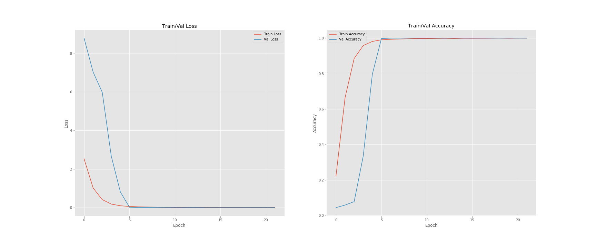

# SIGN LANGUAGE RECOGNITION
The dataset format is patterned to match closely with the classic MNIST. Each training and test case represents a label (0-25) as a one-to-one map for each alphabetic letter A-Z (and no cases for 9=J or 25=Z because of gesture motions). 
The training data (27,455 cases) and test data (7172 cases) are approximately half the size of the standard MNIST but otherwise similar with a header row of label, pixel1,pixel2....pixel784 which represent a single 28x28 pixel image with grayscale values between 0-255. 
The original hand gesture image data represented multiple users repeating the gesture against different backgrounds. 
The Sign Language MNIST data came from greatly extending the small number (1704) of the color images included as not cropped around the hand region of interest. 
To create new data, an image pipeline was used based on ImageMagick and included cropping to hands-only, gray-scaling, resizing, and then creating at least 50+ variations to enlarge the quantity. 
The modification and expansion strategy was filters ('Mitchell', 'Robidoux', 'Catrom', 'Spline', 'Hermite'), 
along with 5% random pixelation, +/- 15% brightness/contrast, and finally 3 degrees rotation. Because of the tiny size of the images, 
these modifications effectively alter the resolution and class separation in interesting, controllable ways.

 


## Results




Classification report:
````
precision    recall  f1-score   support

           A       1.00      1.00      1.00       331
           B       1.00      1.00      1.00       432
           C       1.00      1.00      1.00       310
           D       1.00      1.00      1.00       245
           E       1.00      1.00      1.00       498
           F       1.00      1.00      1.00       247
           G       1.00      1.00      1.00       348
           H       1.00      1.00      1.00       436
           I       1.00      1.00      1.00       288
           K       1.00      1.00      1.00       331
           L       1.00      1.00      1.00       209
           M       1.00      1.00      1.00       394
           N       1.00      1.00      1.00       291
           O       1.00      1.00      1.00       246
           P       1.00      1.00      1.00       347
           Q       1.00      1.00      1.00       164
           R       1.00      0.99      1.00       144
           S       1.00      1.00      1.00       246
           T       1.00      1.00      1.00       248
           U       1.00      1.00      1.00       266
           V       1.00      1.00      1.00       346
           W       1.00      1.00      1.00       206
           X       1.00      1.00      1.00       267
           Y       1.00      1.00      1.00       332

    accuracy                           1.00      7172
   macro avg       1.00      1.00      1.00      7172
weighted avg       1.00      1.00      1.00      7172
````